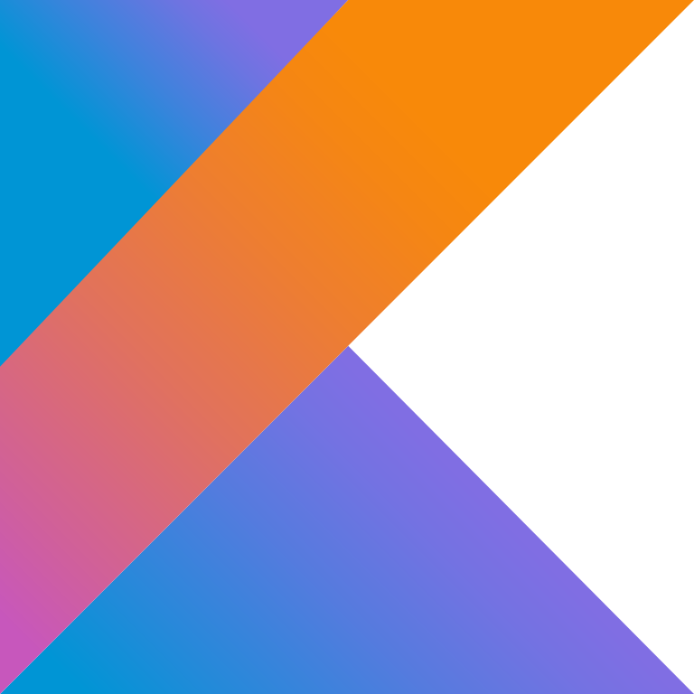

  

  
  
  
  
  
  
  

  

## About Me :
- 👨🏻‍🎓 I’m currently pursuing B.Tech in Computer Science Engineering 💻 in VIT Bhopal.
- 🌱 I’m currently learning Android Developing
- 🤝 I’m looking to collaborate with other developers and build cool projects
- 🎯 Goals: Learning Android Development.
- 📫 How to reach me <u>**ayon.das2021@vitbhopal.ac.in**</u>

## Connect with me :

  

## Languages and Tools :

    

    

    

  

